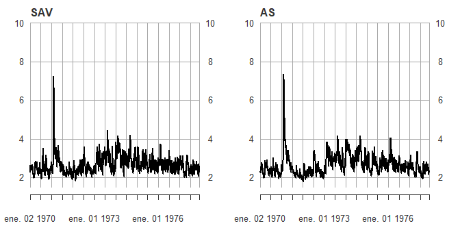
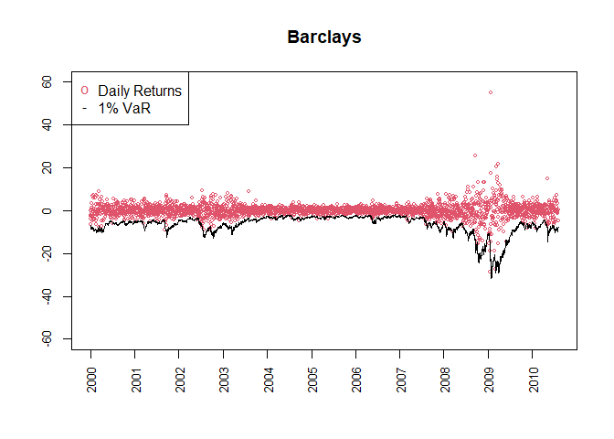

<!-- README.md is generated from README.Rmd. Please edit that file -->

# QuantileModels

<!-- badges: start -->

<!-- badges: end -->

The goal of QuantileModels is to provide the proper tools for the estimation and inference of different quantile models, at the moment only Conditional autoregressive value at risk (CAViaR) model proposed by Engle & Manganelli (2004) <https://doi.org/10.1198/073500104000000370> and it’s multivariate extension MVMQ-CAViaR proposed y White et al. (2015) <https://doi.org/10.1016/j.jeconom.2015.02.004> are avalible, however, in further updates, other models and extensions will be included.

## Installation

You can install the development version of QuantileModels like so:

``` r
library(remotes)
install_github("ChJoCa/QuantileModels")
```

It should be noted that this package contains C++ code (RcppArmadillo), so to install it compilation must be done.

## Example

Here there are some examples to the estimation of the models implemented by now.

The first is the Symmetric absolute value and the Asymmetric Slope models from Engle and Manganelli (2004). Of course, there are other spcifications, and all can be estimated for a given order of p autoregressive quantile and q order of lagged Y values.

``` r
library(QuantileModels)

data=dataCAViaR

SAV <- CAViaR(Y=data$GM[1:2892],
model.type = "SAV",p=1,q=1,band.hs = TRUE,quant.type = 7,
tau=0.05,refine.estim = FALSE)
#> Begining optimization
#> Calculating Standard Errors

summary(SAV)
#> CAViaR estimation 
#> -------------------
#> Model specification: SAV 
#> Quantile (tau): 0.05 
#> Loss function value at estimates: 551.2903 
#> In-sample coverage: 0.05014 
#> Hall-Sheather bandwidth 
#> 
#> Estimation results: 
#> ======================================================== 
#>            Coef.     S.E   P>|t|  2.5% CI 97.5% CI
#> Beta 0  -0.15817 0.09835 0.10788 -0.35102  0.03467
#> Beta 1   0.88566 0.04309 0.00000  0.80118  0.97014
#> Gamma 1 -0.11445 0.01711 0.00000 -0.14800 -0.08091
#> ======================================================== 
#> 
#> Coverage test 
#> -------------------
#> Kupiec conditional coverage test (LRcc), p-value: 0.91283 
#> Christoffersen independence test (LRind), p-value: 0.67031 
#> Christoffersen unconditional coverage test (LRuc), p-value: 0.97279

AS <- CAViaR(Y=data$GM[1:2892],
model.type = "AS",p=1,q=1,band.hs = TRUE,quant.type = 7,
tau=0.05,refine.estim = FALSE)
#> Begining optimization
#> Calculating Standard Errors

summary(AS)
#> CAViaR estimation 
#> -------------------
#> Model specification: AS 
#> Quantile (tau): 0.05 
#> Loss function value at estimates: 548.3021 
#> In-sample coverage: 0.04945 
#> Hall-Sheather bandwidth 
#> 
#> Estimation results: 
#> ======================================================== 
#>             Coef.     S.E   P>|t|  2.5% CI 97.5% CI
#> Beta 0   -0.07599 0.03250 0.01944 -0.13971 -0.01227
#> Beta 1    0.93262 0.01424 0.00000  0.90470  0.96054
#> Gamma+,1 -0.03977 0.02103 0.05876 -0.08101  0.00147
#> Gamma-,1  0.12179 0.01453 0.00000  0.09330  0.15027
#> ======================================================== 
#> 
#> Coverage test 
#> -------------------
#> Kupiec conditional coverage test (LRcc), p-value: 0.64971 
#> Christoffersen independence test (LRind), p-value: 0.35833 
#> Christoffersen unconditional coverage test (LRuc), p-value: 0.89123

par(mfrow=c(1,2))

plot(-SAV$VaR,.by="quarter",ylim=c(1.5,10),main="SAV",main.timespan=FALSE)
plot(-AS$VaR,.by="quarter",ylim=c(1.5,10),main="AS",main.timespan=FALSE)
```



The other model is it’s multivariate version proposed by White, Kim, and Manganelli (2015)

``` r
Barclays <- MVMQ_CAViaR(MVMQ[,c(6,1)],tau =c(0.01,0.01),band.hs = TRUE)
#> Begining optimization
#> Computing Standard Errors

summary(Barclays)
#> MVMQ CAViaR estimation 
#> Loss function at estimates: 324.0218 
#> Hall-Sheather bandwidth 
#> ======================================================== 
#> Equation: yEU_index 
#> Quantile (tau): 0.01 
#> In sample coverage 0.01049 
#> Estimation results: 
#> -------------------------------------------------------- 
#>                               Coef.     S.E   P>|t|  2.5% CI 97.5% CI
#> Const.                     -0.13209 0.04568 0.00387 -0.22166 -0.04251
#> q.yEU_index,1               0.80808 0.04854 0.00000  0.71290  0.90326
#> q.BARCLAYS - PRICE INDEX,1 -0.01093 0.00695 0.11565 -0.02455  0.00269
#> |yEU_index|,1              -0.51111 0.12095 0.00002 -0.74827 -0.27395
#> |BARCLAYS - PRICE INDEX|,1 -0.05018 0.01083 0.00000 -0.07142 -0.02894
#> 
#> Coverage test 
#> -------------------
#> Kupiec conditional coverage test (LRcc), p-value: 0.70412 
#> Christoffersen independence test (LRind), p-value: 0.42513 
#> Christoffersen unconditional coverage test (LRuc), p-value: 0.79796 
#> -------------------------------------------------------- 
#> 
#> Equation: BARCLAYS - PRICE INDEX 
#> Quantile (tau): 0.01 
#> In sample coverage 0.00976 
#> Estimation results: 
#> -------------------------------------------------------- 
#>                               Coef.     S.E   P>|t|  2.5% CI 97.5% CI
#> Const.                     -0.09075 0.04920 0.06519 -0.18722  0.00571
#> q.yEU_index,1              -0.12595 0.06035 0.03697 -0.24428 -0.00762
#> q.BARCLAYS - PRICE INDEX,1  0.95959 0.01066 0.00000  0.93868  0.98049
#> |yEU_index|,1              -0.33446 0.12710 0.00855 -0.58369 -0.08524
#> |BARCLAYS - PRICE INDEX|,1 -0.14545 0.07610 0.05608 -0.29467  0.00378
#> 
#> Coverage test 
#> -------------------
#> Kupiec conditional coverage test (LRcc), p-value: 0.08638 
#> Christoffersen independence test (LRind), p-value: 0.02713 
#> Christoffersen unconditional coverage test (LRuc), p-value: 0.90074 
#> --------------------------------------------------------

dates <- as.Date(zoo::index(MVMQ))

plot(dates,as.vector(MVMQ[,1]),type = "p",ylim = c(-60,60),cex=0.6,xaxt="n",cex.axis=0.8,col=2,xlab="",ylab = "",main = "Barclays")
lines(dates,Barclays[[5]][,2],type = "l")
axis.Date(side=1,at=seq(dates[1],dates[2765],by="year"),cex.axis=0.8,las=2)
legend("topleft",legend = c("Daily Returns","1% VaR"),col = 2:1,pch = c("o","-"))
```



# References

Engle, Robert F, and Simone Manganelli. 2004. “CAViaR.” *Journal of Business & Economic Statistics* 22 (4): 367–81. <https://doi.org/10.1198/073500104000000370>.

White, Halbert, Tae-Hwan Kim, and Simone Manganelli. 2015. “VAR for VaR: Measuring Tail Dependence Using Multivariate Regression Quantiles.” *Journal of Econometrics* 187 (1): 169–88. <https://doi.org/10.1016/j.jeconom.2015.02.004>.
