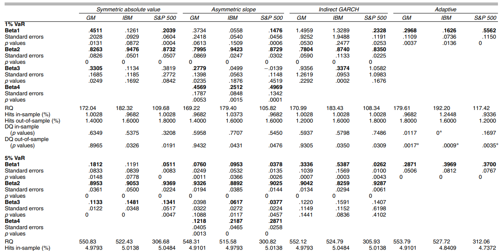
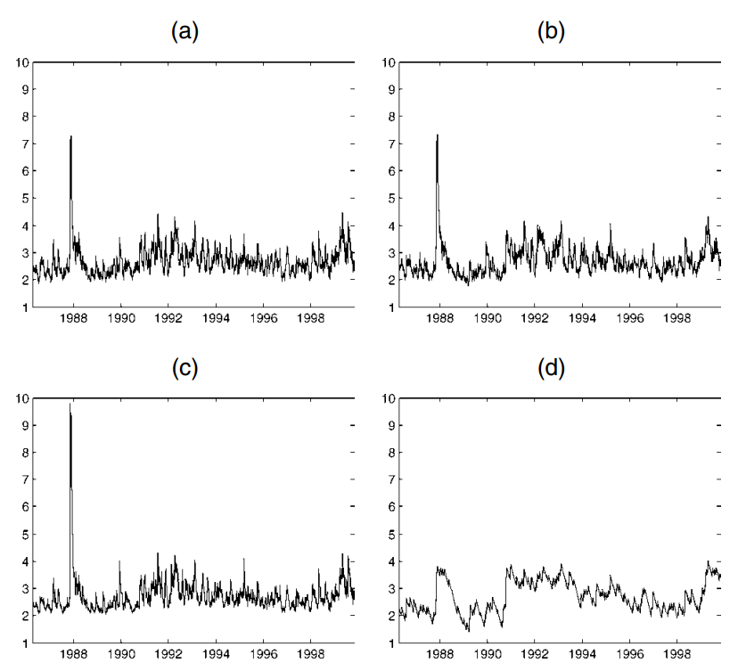

```{r, include = FALSE}
knitr::opts_chunk$set(
  collapse = TRUE,
  comment = "#>"
)
```

```{r, setup, echo=FALSE,message=FALSE}
library(QuantileModels)
```

This document introduces the capabilities of this package, the available models, and how to estimate them and obtain the results of those estimates. In short, it serves as a brief tutorial and user guide.

This package enables users to estimate the models proposed by @engle2004, as well as their subsequent multivariate version presented by @white2015. Unlike other currently available functions or code[^1], this package enables estimation of these models for autoregressive quantile lags of order p, and q for values of the variable itself.

[^1]: To the best of my knowledge

# Conditional Autoregressive value at risk (CAViaR)

This package includes four different specifications, which are listed below:

-   Symmetric Absolute Value (SAV)

$$
f_t(\theta) = \beta_0 + \sum_{i=1}^p \beta_i f_{t-i}(\theta) + \sum_{j=1}^q \gamma_j |y_{t-j}|
$$

-   Asymmetric slope (AS)

$$
f_t(\theta) = \beta_0 + \sum_{i=1}^p \beta_i f_{t-i}(\theta) + \sum_{j=1}^q \left( \gamma_{1,j} (y_{t-j})^+ + \gamma_{2,j} (y_{t-j})^- \right)
$$

where ${(y_{t-j})^+ = \max(y_{t-j}, 0)}$ and $(y_{t-j})^- = \min(y_{t-j}, 0)$.

-   Indirect GARCH (INDGARCH)

$$
f_t(\theta) = \left( \beta_0 + \sum_{i=1}^p \beta_i f_{t-i}^2(\theta) + \sum_{j=1}^q \gamma_j y_{t-j}^2 \right)^{1/2}
$$

-   Improved CAViaR (I-CAV) [@huang2009]

$$
f_t(\theta) = \beta_0 + \beta_1 f_{t-1}(\theta) + (1 - \beta_1)\left(\frac{\nu}{1-\gamma_1} I(y_{t-1} > 0)+ \frac{\nu}{\gamma_1} I(y_{t-1} \leq 0)\right) |y_{t-1} - u|
$$

where ${\nu = \sqrt{\gamma_1^2 + (1 - \gamma_1)^2}}$ ,$0<\gamma_1<1$ and $u$ is the sample mean.

The following section illustrates how to use the \code{CAViaR()} function to estimate this model. It does so using data from @engle2004 for the GM series at the 5% quantile.

```{r message=FALSE}
data=dataCAViaR

SAV <- CAViaR(Y=data$GM[1:2892],
model.type = "SAV",p=1,q=1,band.hs = TRUE,quant.type = 7,
tau=0.05,refine.estim = FALSE)

AS <- CAViaR(Y=data$GM[1:2892],
model.type = "AS",p=1,q=1,band.hs = TRUE,quant.type = 7,
tau=0.05,refine.estim = FALSE)

INDGARCH <- CAViaR(Y=data$GM[1:2892],
model.type = "INDGARCH",p=1,q=1,band.hs = TRUE,quant.type = 7,
tau=0.05,refine.estim = FALSE)

I_CAV <- CAViaR(Y=data$GM[1:2892],
model.type = "I-CAV",p=1,q=1,band.hs = TRUE,quant.type = 7,
tau=0.05,refine.estim = FALSE)

```

To see the results, use the \code{summary()} or \code{print()} functions. This will show you important information about the estimation process, the estimated coefficients, standard errors, p-values, and confidence intervals for the coefficients. It will also show you coverage tests for the value at risk.

```{r }
summary(SAV)
```

The following table shows the results of the estimation for the various specifications, which can be compared with those in the original study by Engle & Manganelli (2004). As is evident, the results are virtually identical. The only noticeable difference lies in the standard errors, which differ for probably two reasons:

1.  Engle & Manganelli (2004) use an "exact formula" to calculate the gradient (Jacobian) of the quantile process function, which is obviously preferable. However, in this specific function, these are calculated using numerical approximations with central finite differences via *numDeriv* (Gilbert & Varadhan, 2019).

2.  In the original work, the bandwidth is calculated using k-nearest neighbors. However, in this implementation, it is calculated based on the multivariate posterior proposal [@white2015], whereas they use the one proposed by @machado2013.

|              |    SAV     |     AS     |  INDGARCH  |   I-CAV    |
|:------------:|:----------:|:----------:|:----------:|:----------:|
|  $\beta_0$   |  -0.1582   |  -0.0760   |   0.3336   |  -0.0384   |
|              | *(0.0984)* | *(0.0325)* | *(0.1174)* | *(0.0226)* |
|  $\beta_1$   |   0.8857   |   0.9326   |   0.9042   |   0.9419   |
|              | *(0.0431)* | *(0.0142)* | *(0.0320)* | *(0.0143)* |
|  $\gamma_1$  |  -0.1145   |     \-     |   0.1220   |   0.3690   |
|              | *(0.0171)* |    *-*     | *(0.0812)* | *(0.0747)* |
| $\gamma_1^+$ |     \-     |  -0.03977  |     \-     |     \-     |
|              |     \-     | *(0.0210)* |     \-     |     \-     |
| $\gamma_1^-$ |     \-     |   0.1218   |     \-     |     \-     |
|              |     \-     | *(0.0145)* |     \-     |     \-     |
|     $RQ$     |   551.29   |   548.30   |   552.12   |   550.10   |
|              |            |            |            |            |
| $\hat{\tau}$ |   0.0501   |   0.0498   |   0.0501   |   0.0498   |

: Estimation results for GM VaR at 5% under different CAViaR specifications.

Here are the results reported in @engle2004.

[](https://www.simonemanganelli.org/Simone/Research_files/caviarPublished.pdf)

In addition, we can visualize the conditional quantile process for GM and compare it with Figure 1 from the original paper.

```{r ,fig.width=9, fig.height=5.5, fig.cap= "GM VaR at 5% under different specifications"}
par(mfrow=c(2,2))

plot(-SAV$VaR,.by="quarter",ylim=c(1.5,10),main="SAV",main.timespan=FALSE)
plot(-AS$VaR,.by="quarter",ylim=c(1.5,10),main="AS",main.timespan=FALSE)
plot(-INDGARCH$VaR,.by="quarter",ylim=c(1.5,10),main="INDGARCH",main.timespan=FALSE)
plot(-I_CAV$VaR,.by="quarter",ylim=c(1.5,10),main="I-CAV",main.timespan=FALSE)
par(mfrow=c(1,1))
```

Note that in this R package, the adaptive specification is not implemented; therefore, you should compare only panels a) through c) and ignore the I-CAV, as it is shown only for visualization and comparison with the other specifications[^2]. Furthermore, for all specifications, an order greater than 1 can be used for both the autoregressive quantile and the lagged value of the series, except for the I-CAV, which currently only allows for estimating I-CAV(1,1).

[^2]: Please also disregard the dates, as the data they have available does not include dates; therefore, dummy dates have simply been included to create the graph. Additionally, note that in the original graphs, they show the VaR for the in-sample and out-of-sample all together, whereas in the graphs presented here, the graph is plotted only within the estimation sample.



Furthermore, you can use the S3 plot() method for the object returned by the CAViaR() function to visualize the result graphically.

```{r, fig.width=6, fig.height=6}
plot(SAV,titl="GM Var at 5%")
```

# VAR for VaR or MVMQ-CAViaR

As well as the univariate model estimation, it is also possible to estimate its multivariate extension proposed by @white2015, which has the following specification:

$$
\boldsymbol{f_t}(\boldsymbol{\theta}) = \boldsymbol{c} + \sum_{i=1}^p \boldsymbol{A_i} \boldsymbol{f_{t-i}(\boldsymbol{\theta})} + \sum_{j=1}^q \boldsymbol{B_j} |\boldsymbol{Y_{t-j}|}
$$

This model can be estimated using the MVMQ_CAViaR() function. Once again, using the data from @white2015, the goal is to reproduce Figure 1 and part of Table 3 (the results for Barclays and Goldman Sachs; the rest is left for the user to verify) as follows:

```{r message=FALSE}
Barclays <- MVMQ_CAViaR(MVMQ[,c(6,1)],tau =c(0.01,0.01),band.hs = TRUE)

Goldman <- MVMQ_CAViaR(MVMQ[,c(7,4)],tau =c(0.01,0.01),band.hs = TRUE)

HSBC <- MVMQ_CAViaR(MVMQ[,c(5,3)],tau =c(0.01,0.01),band.hs = TRUE)

Deutsche <- MVMQ_CAViaR(MVMQ[,c(6,2)],tau =c(0.01,0.01),band.hs = TRUE)
```

Using the \code{summary()} function

```{r message=FALSE}
summary(Barclays)

summary(Goldman)
```

It can be seen that the estimates are very similar to those obtained by the authors, although there are differences in certain parameters and their respective significance. In this regard, future improvements could be made to ensure that the results are more consistent.

However, from a graphical perspective, these results generate virtually the same quantile process, as can be seen in the following graphs, which are virtually identical to those in Figure 1 of @white2015.

```{r fig.width=8, fig.height=5}
dates <- as.Date(zoo::index(MVMQ))

#Barclays
plot(dates,as.vector(MVMQ[,1]),type = "p",ylim = c(-60,60),cex=0.6,xaxt="n",cex.axis=0.8,col=2,xlab="",ylab = "",main = "Barclays")
lines(dates,Barclays[[5]][,2],type = "l")
axis.Date(side=1,at=seq(dates[1],dates[2765],by="year"),cex.axis=0.8,las=2)
legend("topleft",legend = c("Daily Returns","1% VaR"),col = 2:1,pch = c("o","-"))

#Deutsche
plot(dates,as.vector(MVMQ[,2]),type = "p",ylim = c(-60,60),cex=0.6,xaxt="n",cex.axis=0.8,col=2,xlab="",ylab = "",main = "Deutsche")
lines(dates,Deutsche[[5]][,2],type = "l")
axis.Date(side=1,at=seq(dates[1],dates[2765],by="year"),cex.axis=0.8,las=2)
legend("topleft",legend = c("Daily Returns","1% VaR"),col = 2:1,pch = c("o","-"))

#Goldman
plot(dates,as.vector(MVMQ[,4]),type = "p",ylim = c(-60,60),cex=0.6,xaxt="n",cex.axis=0.8,col=2,xlab="",ylab = "",main = "Goldman")
lines(dates,Goldman[[5]][,2],type = "l")
axis.Date(side=1,at=seq(dates[1],dates[2765],by="year"),cex.axis=0.8,las=2)
legend("topleft",legend = c("Daily Returns","1% VaR"),col = 2:1,pch =c("o","-"))

#HSBC
plot(dates,as.vector(MVMQ[,3]),type = "p",ylim = c(-60,60),cex=0.6,xaxt="n",cex.axis=0.8,col=2,xlab="",ylab = "",main = "HSBC")
lines(dates,HSBC[[5]][,2],type = "l")
axis.Date(side=1,at=seq(dates[1],dates[2765],by="year"),cex.axis=0.8,las=2)
legend("topleft",legend = c("Daily Returns","1% VaR"),col = 2:1,pch = c("o","-"))
```

Of course, just as in the univariate case, the resulting object can also be plotted using \code{plot()}

```{r fig.width=8, fig.height=5}
plot(Barclays,rows=2,columns=1)
plot(Goldman,rows=2,columns=1)
```

\newpage

# References
